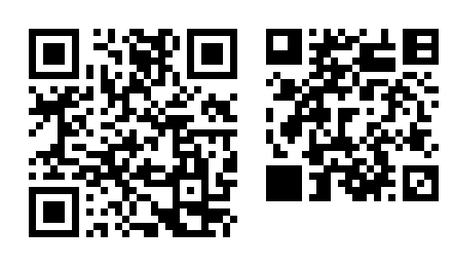

# NMT Code

[English](README.md) | 한국어

NMT Code(needmoretruth code)는 요즘 폰과 컴퓨터의 카메라로 읽는 2차원 코드입니다. 같은 내용을
QR 코드보다 적은 모듈에 담습니다.



왼쪽 코드에는 `https://github.com/needmoretruth/nmtcode`가 들어 있습니다. 오른쪽 QR 코드에도 같은
주소가 들어 있어서, QR 코드만 읽는 폰으로 찍으면 이 페이지로 옵니다.

> **버전 0.0.1은 프로토타입입니다.** 흑백 코드를 PNG나 SVG로 만들고, 직접 만든 PNG 파일을 다시
> 읽습니다. 카메라 사진 읽기, 색 코드, 여러 장으로 파일 옮기기는 아직 만들고 있습니다. 형식은 0.x
> 버전마다 바뀔 수 있습니다.

## QR 코드와 크기 비교

| 내용 | 바이트 | NMT Code | QR 코드 |
|---|---:|---:|---:|
| `https://github.com/needmoretruth/nmtcode` | 40 | 24 × 24 = 576 | 29 × 29 = 841 |
| 한국어 문장, UTF-8로 84바이트 | 84 | 32 × 32 = 1,024 | 37 × 37 = 1,369 (UTF-8) · 33 × 33 = 1,089 (EUC-KR) |
| 87바이트 영어 문장 | 87 | 32 × 32 = 1,024 | 37 × 37 = 1,369 |
| 숫자 50개 | 50 | 24 × 24 = 576 | 25 × 25 = 625 |

- 두 코드 모두 가장 낮은 오류 정정 수준입니다. 바이트의 약 7.5%(NMT Code)와 7%(QR 코드)를
  되살립니다. QR 코드는 그 내용이 들어가는 가장 작은 버전입니다. QR 리더 중에는 한국어를 UTF-8일
  때만 제대로 읽는 것이 많습니다.
- 모듈 수에 여백은 넣지 않았습니다. NMT Code는 네 변에 2모듈씩, QR 코드는 4모듈씩 필요합니다.
- 코드 옆의 QR 코드만큼 그림이 커집니다. `--no-qr`을 주면 빠집니다.
- 2026-09-29에 nmtcode 0.0.1, zxing-cpp 3.1.1, segno 1.6.6으로 쟀습니다. 카메라로 읽히는 거리와
  실패율은 아직 재지 않았습니다.

## 설치

[Rust](https://rustup.rs)로 소스에서 빌드합니다. 저장소가 Rust 1.98.1을 고정해 두었고, 첫 빌드 때
`rustup`이 설치합니다.

```sh
git clone https://github.com/needmoretruth/nmtcode.git
cd nmtcode
cargo install --path crates/nmtcode-cli --locked
nmtcode --version
```

## 명령 쓰기

```sh
nmtcode make --url https://example.com -o link.png
nmtcode make --text "7시에 북문에서 만나요" -o note.svg
nmtcode make --file report.pdf -o report.png
nmtcode make --profile print --dpi 600 --text "인쇄용 라벨" -o label.png

nmtcode read link.png
nmtcode read report.png --out received/
nmtcode read note.png --json
```

- `make`는 파일 확장자에 따라 PNG나 SVG로 씁니다. `--level 0-3`으로 오류 정정 수준을,
  `--size WxH` · `--max-width` · `--max-height`로 크기를 모듈 수로 정합니다.
- `read`는 글과 주소를 출력하고, 주소를 열지 않습니다. 파일은 `--out`을 줄 때만, 있는 파일을 덮어쓰지
  않고, 폴더 경로를 뗀 이름으로 저장합니다.
- 옵션 전부는 `nmtcode make --help`와 `nmtcode read --help`에 있습니다.

## 라이브러리 쓰기

```rust
use nmtcode::{DecodeOptions, EncodeOptions};
use nmtcode_render::RenderOptions;

let url = "https://github.com/needmoretruth/nmtcode";
let symbol = nmtcode::encode_url(url, &EncodeOptions::default())?;
let png = nmtcode_render::render_png(symbol.grid(), &RenderOptions::default())?;

for grid in nmtcode_detect::read_png(&png)? {
    let decoded = nmtcode::decode(&grid, &DecodeOptions::default())?;
    println!("{}", decoded.records[0].text().unwrap_or("(binary record)"));
}
```

전체 프로그램은 [`crates/nmtcode-cli/examples/round_trip.rs`](crates/nmtcode-cli/examples/round_trip.rs)입니다.

| 크레이트 | 하는 일 | `no_std` |
|---|---|---|
| `nmtcode` | 기록을 모듈 격자로 만들고 다시 읽기 | |
| `nmtcode-core` | 모듈 격자, 형식 단어, 컨테이너, 기록, CRC-32C, 리더 오류 | ✅ |
| `nmtcode-ecc` | GF(2^8) 위의 리드-솔로몬 오류 정정 | ✅ |
| `nmtcode-payload` | 코덱: 그대로, 숫자, 영숫자, 토큰 표, 한글 묶음, brotli | ✅ brotli 없이 |
| `nmtcode-symbol` | 찾기 무늬, 기준 표시, 모듈 배치, 화이트닝 | ✅ |
| `nmtcode-render` | 옆에 QR 코드를 붙인 PNG · SVG 출력 | |
| `nmtcode-detect` | 렌더러가 만든 PNG에서 코드 찾기 | |
| `nmtcode-cli` | `nmtcode` 명령 | |

`no_std` 크레이트는 `wasm32-unknown-unknown`으로도 빌드됩니다. `unsafe`를 쓰는 크레이트는 없습니다.

## 명세

형식은 [`spec/`](spec/01-scope-and-conventions.md)에 영어로 적혀 있고, 지금은 초안 0.1입니다. 비트
하나까지 정해 두어서, 다른 프로그램이 이 코드 없이도 NMT Code를 만들고 읽을 수 있습니다. 명세의
계산 예시와 완성된 시험 코드([부록 A](spec/annex-a-test-vectors.md))는 이 저장소의 시험입니다.

## 검사

```sh
scripts/check.sh
```

서식, clippy, 모든 시험, `no_std` 크레이트의 `wasm32` 빌드, 크레이트 버전이 1.0.0에 닿지 않았는지를
검사합니다.

## 라이선스

- 코드: [MIT](LICENSE-MIT) 또는 [Apache-2.0](LICENSE-APACHE) 중 고르시면 됩니다.
- 명세(`spec/`): [CC BY 4.0](spec/LICENSE). CC BY 4.0은 특허 권리를 주지 않습니다.

QR Code는 DENSO WAVE INCORPORATED의 등록 상표입니다.
